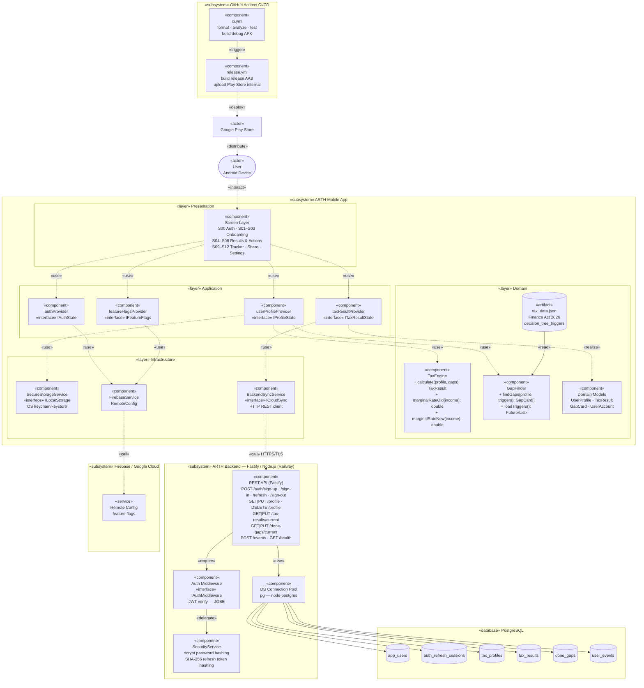
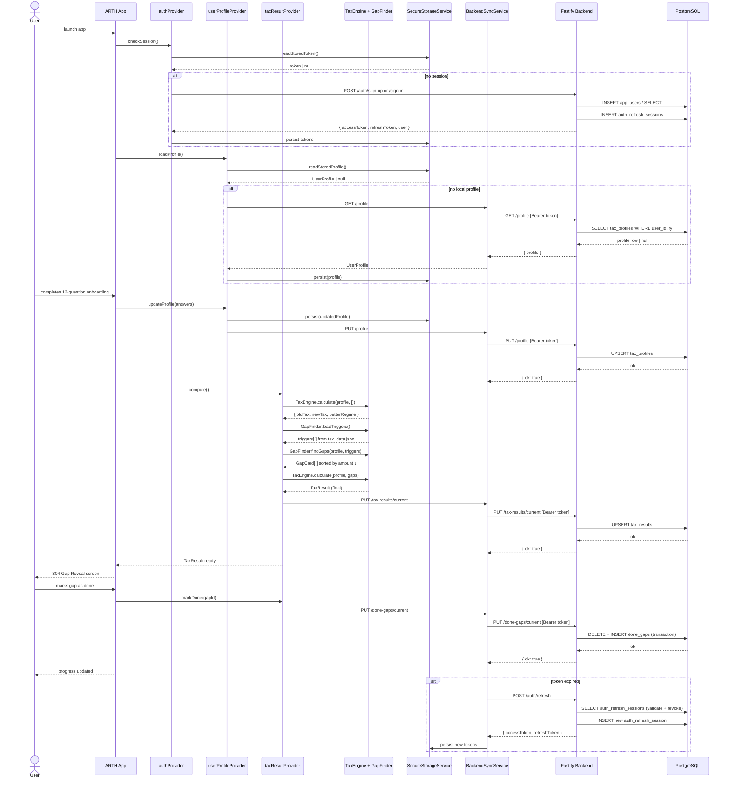

# ARTH: Tax Deduction Gap Analyzer

## Problem & Solution

**The Problem:** Salaried Indians lose Rs. 50,000+ per year in unclaimed deductions. They don't know they're eligible for standard deductions, LTA, professional development, home office setup during WFH.

**The Solution:** A 3-minute guided questionnaire that shows you exactly what deductions you're missing, without asking for PAN or ITR uploads.

---

## Quick Navigation

- [What You Get](#what-you-get)
- [Core Insights](#core-insights-what-i-learned)
- [Impact & Metrics](#impact--metrics)
- [Security Posture](#security-posture)
- [Technical Architecture](#-technical-architecture)
- [Setup & Usage](#setup--usage)
- [FAQ](#faq)

---

## What You Get

Twelve focused steps map to 8+ tax deduction categories. Answer once. ARTH calculates your gap across:

- **80C** investment deductions (₹1.5L limit)
- **80CCD(1B)** NPS contributions (₹50k extra)
- **80D** health insurance (self + family)
- **80GG** rent deduction (if applicable)
- **80E** education loan interest
- **Sec 24(b)** home loan interest
- **80TTA/80TTB** savings interest (age-based)
- **80CCD(2)** employer NPS (informational)

Plus automatic regime comparison (old vs new tax regime for FY 2026-27).

**Output:** A prioritized list of gaps + actionable next steps.

---

## Design Philosophy

### Why Guided Input, Not Document Upload?

We tested two approaches:

**Option A:** Auto-fill from ITR/income data. Easier technically. Users said no. They don't trust sending their PAN to a fintech app.

**Option B:** A short guided flow, local-first calculations, and account sync for continuity across sessions. No PAN or ITR upload required.

We picked B. This wasn't only a technical choice; it was a trust choice. Users care about privacy more than convenience.

Finance Act 2025 compliance added a second layer: ARTH avoids collecting high-risk identifiers that are not needed for gap discovery.

## Security Posture

ARTH is a guided tax-gap analyzer for salaried users. It is not an ITR filing
tool, legal advice service, CA replacement, bank account aggregator, or formal
GDPR compliance certificate.

The product follows privacy-by-design defaults: no PAN, no ITR uploads, no bank
statements, and no raw income documents are required. If you create an account,
ARTH stores your email, hashed password, profile answers, calculated result,
done-gap progress, and basic app events needed to run and improve the service.
Local app data is stored through OS keychain/keystore-backed secure storage.

The backend uses explicit production CORS, short-lived access tokens,
hashed refresh tokens, password hashing, rate limits, security headers,
redacted logs, ownership checks on user data, and fail-fast production config
validation. Release readiness requires green CI, backend tests, dependency
audit, zero unresolved security alerts, verified production environment values,
and a working database restore path.

Users can delete synced profile, result, and progress data from Settings. Secret
or vulnerability reports should follow [SECURITY.md](./SECURITY.md).

### The Questionnaire Decision (Completion Rates)

We tested comprehensiveness vs. actual completion:

| Questions | Completion Rate |
|-----------|-----------------|
| 15 questions | 40% |
| 10 questions | 60% |
| Focused guided flow | 80% |

More information sounds better. It doesn't work. Users drop off when decision fatigue sets in. We optimized for people actually finishing the flow, not for having every possible detail.

---

## Core Insights (What I Learned)

### 1. Trust Beats Convenience

Users prefer guided answers over uploading their ITR. Privacy matters more than friction reduction. The feature that gets users to completion is the one they trust.

### 2. Product Alone Isn't Distribution

ARTH validated the problem and proved the solution works. But without (a) employer partnerships or (b) tax season campaigns, growth is a solo user acquisition problem. I'm a product person, not a growth marketer.

### 3. When to Deprioritize

ARTH showed me the difference between "problem is real" and "can build a business." The problem was real. The business model wasn't clear. So I focused on NextHire instead (B2B, recurring, clearer unit economics).

---

## Impact & Metrics

| Metric | Result |
|--------|--------|
| Alpha Users | 10 |
| Rating | 4.8/5 (from those who completed) |
| Avg Time to Insight | 3 minutes |
| Finance Act 2025 Compliance | ✓ Validated |
| Completion Rate | 80% |

---

---

# 🔧 Technical Architecture

Below is the complete technical implementation. This section is organized for developers building on or maintaining the app.

---

## System Design

### UML Component Diagram



### UML Sequence Diagram — Core Flow



### System Architecture

```
┌─────────────────────────────────────────────────────────────────┐
│                        ARTH Android App                         │
│  (Flutter 3 / Dart — Riverpod state / go_router navigation)     │
│                                                                  │
│  ┌────────────┐   ┌────────────────┐   ┌──────────────────────┐ │
│  │  Screens   │   │   Providers    │   │       Engine         │ │
│  │ S00–S12    │◄──│ (Riverpod)     │◄──│  TaxEngine           │ │
│  │            │   │ userProfile    │   │  GapFinder           │ │
│  │            │   │ taxResult      │   │  (12 triggers)       │ │
│  │            │   │ auth           │   └──────────────────────┘ │
│  │            │   │ featureFlags   │                            │
│  └────────────┘   └───────┬────────┘                            │
│                           │                                     │
│  ┌────────────────────────▼────────────────────────────────┐    │
│  │                     Services Layer                      │    │
│  │  SecureStorageService   BackendSyncService              │    │
│  │  (OS keychain/keystore) (Backend REST)                  │    │
│  └──────────┬─────────────────────────┬────────────────────┘    │
└─────────────┼─────────────────────────┼────────────────────────-┘
              │                         │
              │              ┌──────────▼──────────────────────────┐
              │              │       ARTH Backend (Railway)         │
              │              │  Fastify + Node.js + TypeScript      │
              │              │                                      │
              │              │  POST /auth/sign-up                  │
              │              │  POST /auth/sign-in                  │
              │              │  POST /auth/refresh                  │
              │              │  GET/PUT /profile                    │
              │              │  GET/PUT /tax-results/current        │
              │              │  GET/PUT /done-gaps/current          │
              │              │  DELETE  /profile                    │
              │              │  POST    /events                     │
              │              └──────────────────┬───────────────────┘
              │                                 │
    ┌─────────▼──────────┐          ┌───────────▼──────────┐
    │  Firebase           │          │  PostgreSQL (Neon /  │
    │  - Remote Config    │          │   Railway)           │
    │                     │          │  app_users           │
    │                     │          │  tax_profiles        │
    │                     │          │  tax_results         │
    └────────────────────┘          │  done_gaps           │
                                    │  auth_refresh_sess.  │
                                    │  user_events         │
                                    └──────────────────────┘
```

### Product Flow


---

## Setup & Usage

### Prerequisites

- Flutter stable channel
- Android SDK
- Java 17

### Quick Start

```bash
git clone https://github.com/rish106-hub/ARTH.git
cd ARTH
flutter pub get
./scripts/dev_android.sh
```

`scripts/dev_android.sh` runs the app on a connected Android phone or emulator
with the live Railway backend. Keep the command running, save Dart changes, and
press `r` in the terminal for hot reload. This is the fastest loop for frontend
work because it does not require uninstalling, downloading, or reinstalling an
APK.

If you specifically need the latest GitHub-built APK, connect the phone and run:

```bash
./scripts/install_latest_apk.sh
```

That downloads the newest successful `main` debug APK and installs it over the
existing app with `adb install -r`, so you do not need to uninstall first.

Backend changes are different: once Railway is deployed, the installed app talks
to the updated backend immediately because `ARTH_API_BASE_URL` points at the
Railway service.

### Backend Setup

```bash
cd backend
cp .env.example .env   # fill DATABASE_URL and 64+ char JWT secrets
npm install
npm run dev
```

### Firebase Configuration

Firebase is used only for Remote Config. The repo ships with `lib/firebase_options.dart` and `android/app/google-services.json`. To point to a different Firebase project:

```bash
dart pub global activate flutterfire_cli
flutterfire configure
firebase deploy --only firestore:rules
```

### Testing

```bash
flutter test                              # full suite
flutter test test/logic_audit_test.dart   # tax logic permutations
flutter test test/ui_audit_test.dart      # narrow-screen layout
```

### Build & Release

```bash
# Debug APK
flutter build apk --debug

# Release bundle
flutter build appbundle --release
```

---

## Project Structure

```
lib/
├── main.dart               App entry, Firebase init
├── app.dart                go_router setup, root widget
├── engine/
│   ├── tax_engine.dart     Old + new regime slab calculator
│   └── gap_finder.dart     12 decision-tree gap triggers
├── models/
│   ├── user_profile.dart   12 onboarding fields
│   ├── gap_card.dart       Single deduction gap model
│   ├── tax_result.dart     Full computation result
│   └── user_account.dart   Auth session model
├── providers/
│   ├── user_profile_provider.dart
│   ├── tax_result_provider.dart
│   ├── auth_provider.dart
│   └── feature_flags_provider.dart
├── screens/
│   ├── s00_auth_screen.dart
│   ├── s01_splash_screen.dart
│   ├── s03_questions_screen.dart      12-step wizard
│   ├── s04_gap_reveal_screen.dart
│   └── ... (8 more screens)
├── services/
│   ├── backend_sync_service.dart
│   ├── secure_storage_service.dart
│   └── server_api_service.dart
├── theme/
│   └── app_theme.dart      Charcoal + gold design system
└── widgets/

backend/
└── src/
    ├── server.ts
    ├── routes.ts           All REST endpoints
    ├── auth.ts             JWT middleware
    └── db.ts               PostgreSQL pool
```

---

## Database Schema

| Table | Purpose |
|-------|---------|
| `app_users` | User accounts + email, password_hash, created_at |
| `auth_refresh_sessions` | JWT refresh token state + expiry |
| `tax_profiles` | 12 onboarding answers per user per FY |
| `tax_results` | Computed tax result, gaps, savings |
| `done_gaps` | User-marked completed gaps (progress tracking) |
| `user_events` | Analytics events |

Full DDL: [database/schema.sql](./database/schema.sql)

---

## Backend API Reference

Base URL: configured per build with `ARTH_API_BASE_URL`, for example
`https://YOUR_BACKEND_DOMAIN/v1`.

### Auth Endpoints

| Method | Path | Body | Response |
|--------|------|------|----------|
| POST | `/auth/sign-up` | `{ name, email, password }` | `{ user, accessToken, refreshToken }` |
| POST | `/auth/sign-in` | `{ email, password }` | `{ user, accessToken, refreshToken }` |
| POST | `/auth/refresh` | `{ refreshToken }` | `{ accessToken, refreshToken }` |
| POST | `/auth/sign-out` | `{ refreshToken }` | `204` |

### Profile & Tax Data

| Method | Path | Auth | Description |
|--------|------|------|-------------|
| GET | `/profile` | yes | Fetch tax profile for current FY |
| PUT | `/profile` | yes | Upsert profile |
| DELETE | `/profile` | yes | GDPR wipe |
| GET | `/tax-results/current` | yes | Fetch saved TaxResult |
| PUT | `/tax-results/current` | yes | Save TaxResult |
| GET | `/done-gaps/current` | yes | Fetch completed gap IDs |
| PUT | `/done-gaps/current` | yes | Update done-gap list |

Full interactive docs: `http://localhost:3000/docs`

---

## Tax Calculation Engine

### Tax Slabs — FY 2026-27

**New Regime:**

| Income | Rate |
|--------|------|
| ₹0 – ₹4L | 0% |
| ₹4L – ₹8L | 5% |
| ₹8L – ₹12L | 10% |
| ₹12L – ₹16L | 15% |
| ₹16L – ₹20L | 20% |
| ₹20L – ₹24L | 25% |
| ₹24L+ | 30% |

87A rebate for income ≤ ₹12L: up to ₹60,000 off.

**Old Regime (below 60):**

| Income | Rate |
|--------|------|
| ₹0 – ₹2.5L | 0% |
| ₹2.5L – ₹5L | 5% |
| ₹5L – ₹10L | 20% |
| ₹10L+ | 30% |

87A rebate for income ≤ ₹5L: up to ₹12,500 off.

### Gap Finder Triggers (12 Decision Trees)

| Trigger | Checks | Gap Amount |
|---------|--------|-----------|
| T01 | 80C invested < ₹1.5L | ₹1.5L minus invested |
| T02 | 80CCD(1B) NPS < ₹50k | ₹50k minus contributed |
| T03 | 80D self (no insurance) | ₹25k (below 60) |
| T04 | 80D parents < 60 | ₹25k |
| T05 | 80D parents 60+ | ₹50k |
| T06 | 80GG rent deduction | min(₹60k, 25% ATI, rent − 10% ATI) |
| T07 | 80E education loan | actual interest or ₹25k estimate |
| T08 | Sec 24(b) home loan | min(interest, ₹2L) |
| T09 | 80TTA savings (below 60) | ₹5k (informational) |
| T10 | 80TTB savings (60+) | ₹25k (informational) |
| T12 | 80CCD(2) employer NPS | ₹1 (action: ask HR) |

---

## CI/CD

| Workflow | Trigger | Steps |
|----------|---------|-------|
| `ci.yml` | push / PR | format, analyze, test, build debug APK |
| `release.yml` | version tag | validate release secrets, build release AAB, upload to Play Store |

Release checklist: [docs/release-preflight.md](./docs/release-preflight.md)

---

## Known Limitations

| Area | Limitation |
|------|-----------|
| HRA calculation | Basic salary approximated as 40% of CTC |
| 80D health insurance | Premiums not collected; deduction excluded from regime comparison |
| 80TTA/80TTB | Surfaced as informational, not modeled from actual interest |
| Donations (80G) | 50% of declared; qualifying limits not enforced |
| Super-senior (80+) | Bundled into "Above 60" group |
| iOS / macOS | Android-only today |

---

## Release Readiness

- [ ] GitHub CI green on `main`
- [ ] Backend tests, build, secret scan, and dependency audit green
- [ ] Dependabot, code scanning, and secret scanning alerts zero
- [ ] Railway env checklist complete
- [ ] Neon backup and restore path verified
- [ ] Release signing + Play Console configuration verified
- [ ] QA on multiple screen sizes

---

## FAQ

**Q: Will this file my tax return?**
No. ARTH identifies gaps. You still file via ITR-1/ITR-2 manually or via a CA.

**Q: Is my data stored?**
Yes, if you create an account. ARTH syncs profile and calculation state to the backend so you can recover it later. Local app cache uses OS keychain/keystore-backed secure storage.

**Q: Does this work for FY 2026-27?**
Yes. Tax slabs + deduction limits are current as of March 2026.

**Q: What if I'm self-employed / have capital gains?**
ARTH is for salaried individuals. Capital gains + business income calculations not included.
