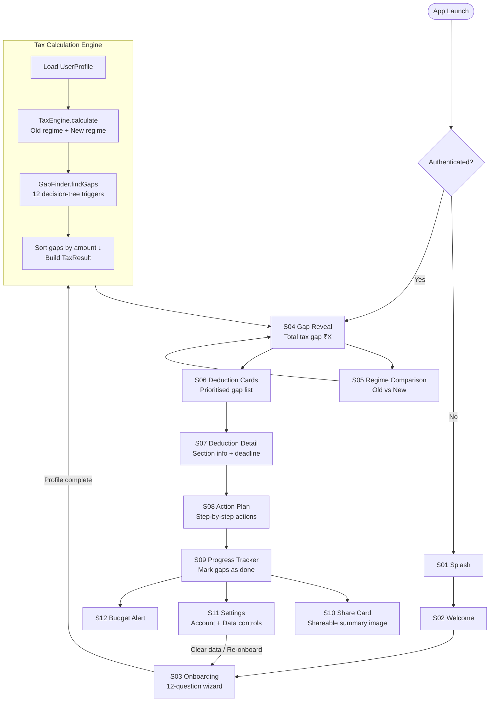
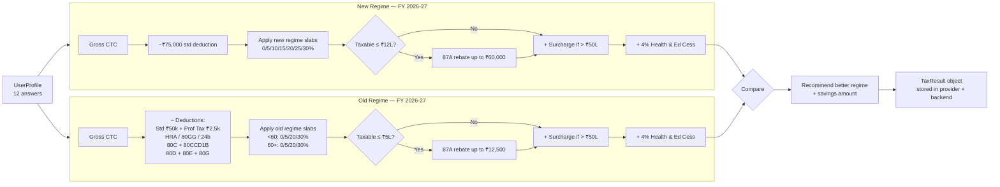
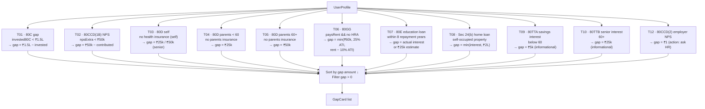
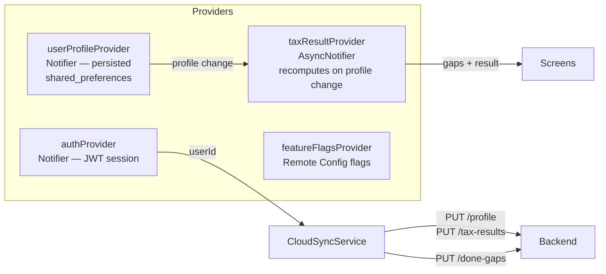

# ARTH — India's First Tax Gap Intelligence App

> Not a rupee less. Not a rupee more.

ARTH is a Flutter Android app for Indian taxpayers (FY 2026-27 / AY 2027-28) that identifies likely missed deductions, compares old vs new tax regimes, and turns the result into prioritised action cards, a progress tracker, and a shareable summary.

**This is a tax-gap discovery product, not an ITR filing platform and not a substitute for professional tax advice.**

---

## Current Status

Verified as of 2026-03-27:

| Check | Result |
|---|---|
| `flutter test` | passing |
| `flutter build apk --debug` | passing |
| Logic audit — 12,960,000 profile permutations | passing |
| Narrow-screen UI audit (320×740) | passing |

Audit artifacts: [AUDIT_LOG.md](./AUDIT_LOG.md) · [LOGIC_AUDIT_RESULTS.md](./LOGIC_AUDIT_RESULTS.md)

---

## System Architecture

```
┌─────────────────────────────────────────────────────────────────┐
│                        ARTH Android App                         │
│  (Flutter 3 / Dart — Riverpod state / go_router navigation)     │
│                                                                  │
│  ┌────────────┐   ┌────────────────┐   ┌──────────────────────┐ │
│  │  Screens   │   │   Providers    │   │       Engine         │ │
│  │ S00–S12    │◄──│ (Riverpod)     │◄──│  TaxEngine           │ │
│  │            │   │ userProfile    │   │  GapFinder           │ │
│  │            │   │ taxResult      │   │  (12 triggers)       │ │
│  │            │   │ auth           │   └──────────────────────┘ │
│  │            │   │ featureFlags   │                            │
│  └────────────┘   └───────┬────────┘                            │
│                           │                                     │
│  ┌────────────────────────▼────────────────────────────────┐    │
│  │                     Services Layer                      │    │
│  │  LocalStorageService    CloudSyncService                │    │
│  │  (shared_preferences)   (Firestore + Backend REST)      │    │
│  └──────────┬─────────────────────────┬────────────────────┘    │
└─────────────┼─────────────────────────┼────────────────────────-┘
              │                         │
              │              ┌──────────▼──────────────────────────┐
              │              │       ARTH Backend (Railway)         │
              │              │  Fastify + Node.js + TypeScript      │
              │              │                                      │
              │              │  POST /auth/sign-up                  │
              │              │  POST /auth/sign-in                  │
              │              │  POST /auth/refresh                  │
              │              │  GET/PUT /profile                    │
              │              │  GET/PUT /tax-results/current        │
              │              │  GET/PUT /done-gaps/current          │
              │              │  DELETE  /profile                    │
              │              │  POST    /events                     │
              │              └──────────────────┬───────────────────┘
              │                                 │
    ┌─────────▼──────────┐          ┌───────────▼──────────┐
    │  Firebase           │          │  PostgreSQL (Neon /  │
    │  - Auth (anon)      │          │   Railway)           │
    │  - Firestore        │          │  app_users           │
    │  - Remote Config    │          │  tax_profiles        │
    │  - Analytics        │          │  tax_results         │
    └────────────────────┘          │  done_gaps           │
                                    │  auth_refresh_sess.  │
                                    │  user_events         │
                                    └──────────────────────┘
```

---

## Product Flow



---

## Tax Calculation Flow



---

## Gap Finder — Decision Tree Triggers



> T11 (regime switch) is handled separately by the regime comparison engine and does not produce a GapCard.

---

## State Management



---

## Backend API Reference

Base URL: `https://arth-backend.railway.app` (or local `http://localhost:3000`)

All protected routes require `Authorization: Bearer <accessToken>`.

### Auth

| Method | Path | Body | Response |
|---|---|---|---|
| POST | `/auth/sign-up` | `{ name, email, password }` | `{ user, accessToken, refreshToken }` |
| POST | `/auth/sign-in` | `{ email, password }` | `{ user, accessToken, refreshToken }` |
| POST | `/auth/refresh` | `{ refreshToken }` | `{ user, accessToken, refreshToken }` |
| POST | `/auth/sign-out` | `{ refreshToken }` | `204` |

### Profile

| Method | Path | Auth | Description |
|---|---|---|---|
| GET | `/me` | yes | Current user account |
| GET | `/profile` | yes | Tax profile for current FY |
| PUT | `/profile` | yes | Upsert full tax profile |
| DELETE | `/profile` | yes | Wipe all user data (GDPR) |

### Tax Data

| Method | Path | Auth | Description |
|---|---|---|---|
| GET | `/tax-results/current` | yes | Saved `TaxResult` payload for current FY |
| PUT | `/tax-results/current` | yes | Save / overwrite `TaxResult` |
| GET | `/done-gaps/current` | yes | Array of actioned gap IDs |
| PUT | `/done-gaps/current` | yes | Replace done-gap list (full sync) |

### Events

| Method | Path | Auth | Description |
|---|---|---|---|
| POST | `/events` | yes | Log a named analytics event |

### Health

| Method | Path | Description |
|---|---|---|
| GET | `/health` | `{ ok: true }` — liveness probe |
| GET | `/ping` | `{ ok: true, ts }` — latency check |

---

## Database Schema

```
app_users
├── id              uuid PK
├── email           unique
├── name
├── password_hash
├── last_seen_at
└── created_at / updated_at

auth_refresh_sessions
├── id              uuid PK
├── user_id         FK → app_users
├── token_hash      SHA-256 of refresh token
├── expires_at
└── revoked_at

tax_profiles  (one row per user per FY)
├── id / user_id / fy
├── name, email, annual_ctc, employment_type
├── city, is_metro_city
├── pays_rent, monthly_rent, has_hra
├── invested_80c
├── has_home_loan, property_type, home_loan_interest
├── has_nps, nps_extra_contribution
├── has_health_insurance_self / parents, parents_above_60
├── has_education_loan, education_loan_repayment_year, education_loan_interest
├── has_donations, donation_amount
└── age_group, updated_at

tax_results   (one row per user per FY)
├── id / user_id / fy
├── old_regime_tax, new_regime_tax
├── old_taxable_income, new_taxable_income
├── total_deductions, better_regime, regime_savings
├── total_gap, gap_count
└── gaps JSONB

done_gaps     (one row per actioned gap)
├── id / user_id / fy
└── gap_id   (e.g. 'T01_80C_gap')

user_events
├── id / user_id
├── name
└── metadata JSONB
```

Full DDL: [database/schema.sql](./database/schema.sql)

---

## Project Structure

```
lib/
├── main.dart               App entry, Firebase init
├── app.dart                go_router setup, root widget
│
├── engine/
│   ├── tax_engine.dart     Old + new regime slab calculator
│   └── gap_finder.dart     12 decision-tree gap triggers
│
├── models/
│   ├── user_profile.dart   12 onboarding fields + derived getters
│   ├── gap_card.dart       Single deduction gap card model
│   ├── tax_result.dart     Full computation result
│   └── user_account.dart   Auth session model
│
├── providers/
│   ├── user_profile_provider.dart   Persisted profile state
│   ├── tax_result_provider.dart     Computed gap state + mark done
│   ├── auth_provider.dart           JWT session state
│   └── feature_flags_provider.dart  Remote Config flags
│
├── screens/
│   ├── s00_auth_screen.dart
│   ├── s01_splash_screen.dart
│   ├── s02_welcome_screen.dart
│   ├── s03_questions_screen.dart      12-step onboarding wizard
│   ├── s04_gap_reveal_screen.dart     Hero gap summary
│   ├── s05_regime_comparison_screen.dart
│   ├── s06_deduction_cards_screen.dart
│   ├── s07_deduction_detail_screen.dart
│   ├── s08_action_plan_screen.dart
│   ├── s09_progress_tracker_screen.dart
│   ├── s10_share_card_screen.dart
│   ├── s11_settings_screen.dart
│   └── s12_budget_alert_screen.dart
│
├── services/
│   ├── (local storage helpers)
│   └── (cloud sync helpers)
│
├── theme/
│   └── app_theme.dart      Charcoal + gold design system
│
└── widgets/                Reusable UI components

assets/
├── images/
├── lottie/
└── tax_data.json           Finance Act 2026 slabs + trigger definitions

backend/
└── src/
    ├── server.ts
    ├── app.ts
    ├── routes.ts           All REST endpoints
    ├── auth.ts             JWT middleware
    ├── security.ts         Argon2 + JOSE
    ├── db.ts               pg Pool
    └── config.ts           env validation (zod)

database/
└── schema.sql

firebase/
├── firestore.rules
└── firestore.indexes.json
```

---

## Tax Slabs — FY 2026-27

### New Regime

| Taxable Income | Rate |
|---|---|
| Up to ₹4,00,000 | 0% |
| ₹4,00,001 – ₹8,00,000 | 5% |
| ₹8,00,001 – ₹12,00,000 | 10% |
| ₹12,00,001 – ₹16,00,000 | 15% |
| ₹16,00,001 – ₹20,00,000 | 20% |
| ₹20,00,001 – ₹24,00,000 | 25% |
| Above ₹24,00,000 | 30% |

87A rebate: taxable ≤ ₹12L → up to ₹60,000 off tax.

### Old Regime (below 60)

| Taxable Income | Rate |
|---|---|
| Up to ₹2,50,000 | 0% |
| ₹2,50,001 – ₹5,00,000 | 5% |
| ₹5,00,001 – ₹10,00,000 | 20% |
| Above ₹10,00,000 | 30% |

87A rebate: taxable ≤ ₹5L → up to ₹12,500 off tax.  
Senior citizens (60+): zero-slab extends to ₹3,00,000.

Surcharge applies above ₹50L income. Cess = 4% on (tax + surcharge) for both regimes.

---

## Design System

Dark-first premium fintech visual language.

| Token | Value |
|---|---|
| Background | `#141414` (near-black charcoal) |
| Primary accent | `#F5C842` (gold) |
| Supporting | Teal, Amber, Red, Green |
| Typography | Inter (body) + Space Grotesk (display) |

Theme: [lib/theme/app_theme.dart](./lib/theme/app_theme.dart)

---

## Local Setup

### Prerequisites

- Flutter stable channel
- Android SDK
- Java 17

### App

```bash
git clone https://github.com/rish106-hub/ARTH.git
cd ARTH
flutter pub get
flutter run
```

### Backend

```bash
cd backend
cp .env.example .env   # fill DATABASE_URL, JWT_SECRET, etc.
npm install
npm run dev
```

---

## Firebase Setup

The repo ships with:
- [lib/firebase_options.dart](./lib/firebase_options.dart)
- `android/app/google-services.json`

To point to a different Firebase project:

```bash
dart pub global activate flutterfire_cli
flutterfire configure
firebase deploy --only firestore:rules
```

---

## Testing

```bash
flutter test                              # full suite
flutter test test/logic_audit_test.dart   # tax logic permutations
flutter test test/ui_audit_test.dart      # narrow-screen layout
```

---

## Build

```bash
# Debug APK
flutter build apk --debug
# → build/app/outputs/flutter-apk/app-debug.apk

# Release bundle
flutter build appbundle --release
```

---

## CI/CD

| Workflow | Trigger | Steps |
|---|---|---|
| [ci.yml](./.github/workflows/ci.yml) | push / PR | format · analyze · test · build debug APK |
| [release.yml](./.github/workflows/release.yml) | version tag | build release AAB → Play Store internal track |

Required GitHub secrets for release: `GOOGLE_SERVICES_JSON`, `KEYSTORE_BASE64`, `KEYSTORE_STORE_PASSWORD`, `KEYSTORE_KEY_PASSWORD`, `KEYSTORE_KEY_ALIAS`, `PLAY_STORE_SERVICE_ACCOUNT_JSON`.

---

## Known Limitations

The engine is stable under the audited sweep but some inputs are approximated because the app does not collect all rupee-level detail during onboarding.

| Area | Limitation |
|---|---|
| HRA / salary structure | Basic salary approximated as 40% of CTC; HRA as 40% of basic |
| 80GG | ATI approximated as 85% of CTC |
| 80D | Health insurance premiums not collected — deduction excluded from regime comparison |
| 80TTA / 80TTB | Surfaced as informational opportunity prompts, not modelled from actual interest |
| 80CCD(2) | Employer NPS routing — shown as action item, not a claimable employee amount |
| Donations | 50% of declared amount applied; qualifying limits not enforced |
| Super-senior (80+) | Bundled into "Above 60" group; 80+ slabs not separately distinguished |
| Done-gap sync | Service layer exists; not fully wired into active UI state flow |
| Budget Alert | Screen and flag present; active navigation path is limited |
| iOS / macOS | Android-only today; iOS release setup not complete |

---

## Release Readiness Checklist

- [ ] Confirm Finance Act assumptions for target filing year
- [ ] Expand onboarding if exact rupee-level computation is required
- [ ] Complete done-gap cross-device sync wiring
- [ ] Decide Budget Alert navigation path
- [ ] Implement or remove dormant features (analytics, messaging, Google Sign-In)
- [ ] Resolve remaining lints from `flutter analyze`
- [ ] Verify release signing and Play Console configuration
- [ ] QA on multiple physical screen sizes and emulators

---

## License

No license file is currently present in this repository.
